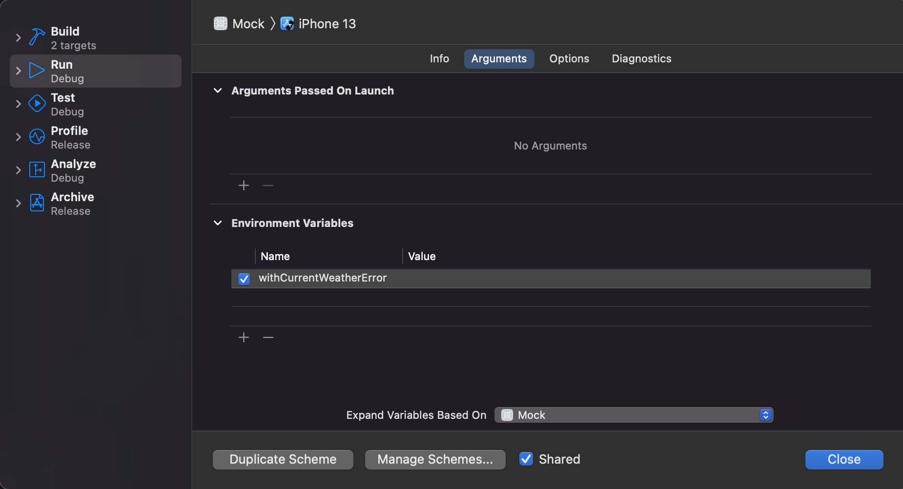
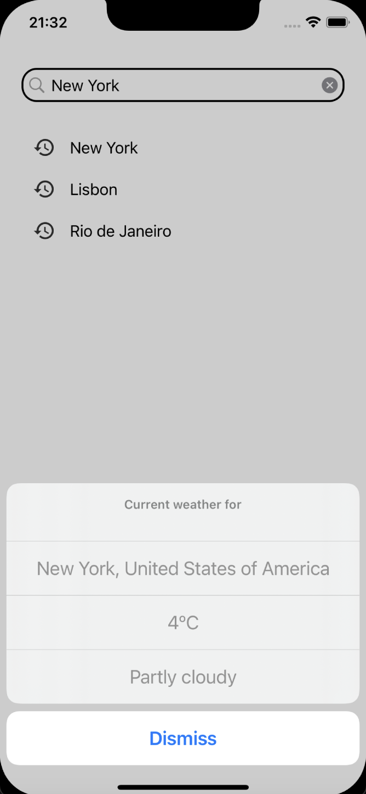
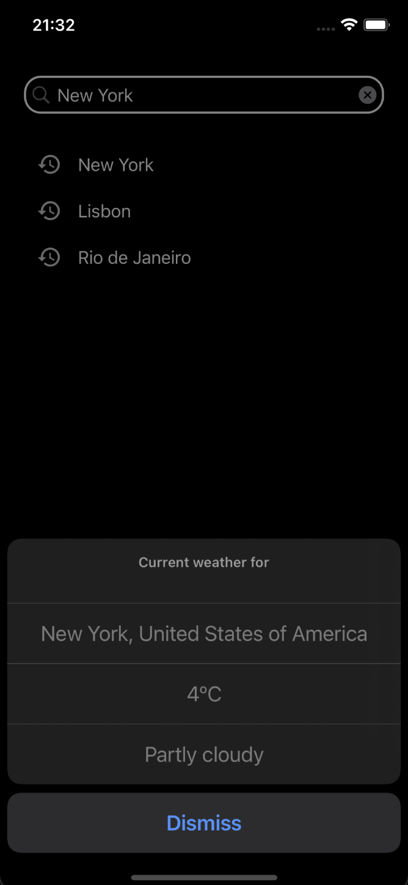

# WeatherApp

Weather App for iOS - Small iOS app made with Swift and UIKit and based on Clean Architecture using https://openweathermap.org/api.

## Features
- Fetches current weather for a location using a query search
- Keeps history of recent search terms for quick search
- UI in plain UIKit (no Storyboards 🎉)
- Extra `Mock` target to run the app with mocked data (more details below)
- Ready for localization
- Dark mode
- Tests:
  - Unit tests
  - Component tests (basically presenter tests with real domain dependencies, except for the gateways, views, and routers)
  - UI tests
- Based on architectures like VIPER and CleanSwift, with the following layers
  - Domain (Use cases, a.k.a, interactors)
  - Data (Gateways for API and DB)
  - Presentation (Presenter, Views, ViewModels, and Router, using an MVP approach)

## Things to improve
- Should implement a real DB with CoreData for persisting the recent search terms (currently uses an in-memory DB)
- Project should be modularized in packages, so unit tests can run in a MacOS target without simulators 
- UI with SwiftUI, so we'll have live preview and less boilerplate
- Structured concurrency with async/await to replace verbose completions

## Run App
API keys must be added on a new file: `/WeatherApp/WeatherApp/Configuration/Secrets.xcconfig`

```
  weather_api_api_key = xxxxxxxxxxxxxxxxxx
```

## Run Mock

App can run with mocked gateways so canned answers will be provided by those gateways. Select the target `Mock` and run the app

You can choose some presets to run the mocked app accordingly to `/WeatherApp/WeatherApp/System/LaunchEnvironmentKey.swift`

Just edit the Mock Scheme and enable the desired environment as the image below:



## Run tests
- `./run_tests.sh`
- `./run_ui_tests.sh`

**Note:** Maybe you'll want to edit the target simulator in those files above with the one available in your machine.

## Screenshots

<table align="center">
  <tr>
     <td>
       
       <p align="center">Main screen in light mode</p>
     </td>
     <td>
       
       <p align="center">Main screen in dark mode</p>
     </td>
  </tr>
</table>
